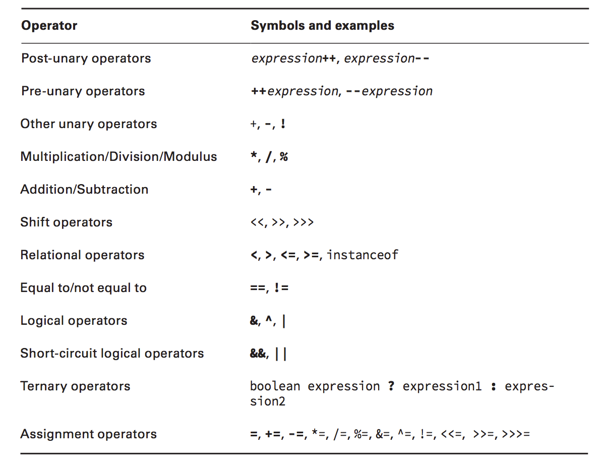

# Operator Order

Eg.:

`int y = 4;`

`double x = 3 + 2 * --y;`

In this example, you would first decrement **y** to 3, and then multiply the resulting value by 2, and finally add 3. The value would then be automatically upcast from 9 to 9.0 and assigned to **x**. The final values of **x** and **y** would be 9.0 and 3, respectively.