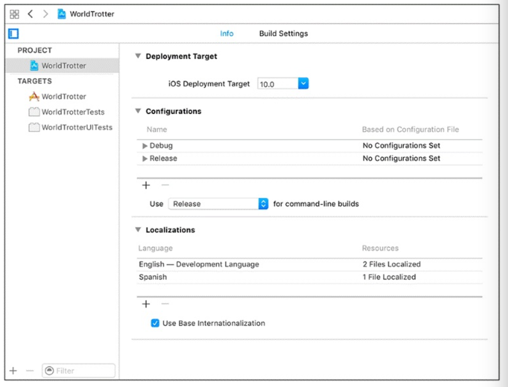

# Internationalization on IOS

When you build an app in Xcode, a `Bundle` is created. All of the resources that you add to an app are copied into this bundle along with the localizing files.

## Base internationalization

When you create a new project, Xcode creates a Base Localization in the `Base.lproj` directory for the default  language.

## Steps to localize your app

1. Internationalize the interface
2. Localize the app
3. Localize dynamically created strings

### 1. Internationalize the interface

Use interface builder preview tool to choose `"Double pseudolanguage"` and add the appropiate constraints.

`View -> Assistant Editor -> Show Assistant Editor`<br>or<br>
`Option-Command-Return`

### 2. Localize the app

1. Select your main .storyboard and `Option-Command-1`
1. Check the _english_ box and make sure that the dropdown says `Localizable Strings`
1. Select your project
1. Select your project under _project_ and select `_info_` tab.
1. Select `+` to add a language under `Localizations`



Now in the project navigator select your main .storyboard and choose the spanish version. As you see the text is not in Spanish. You have to translate it by yourself.

### 3. Localize dynamically created strings

To translate strings in your code you replace literal strings with the function:

```Swift
NSLocalizedString(_:comment:)
```

Example:

```Swift
let greeting = NSLocalizedString("Hello!", comment: "The greeting for the user")
```

This function will look through the strings tables bundled with your application for a match. To generate those tables we use a command-line app:

`~> genstrings xxx.swift`

The resulting file, `Localizable.strings`, contains the strings from the file xxx.swift. Now drag this file to the project navigator.

### Errors

If you get any error running the genstrings command, run:

`~> sudo xcode-select -s /Applications/Xcode.app/Contents/Developer`

and try again.