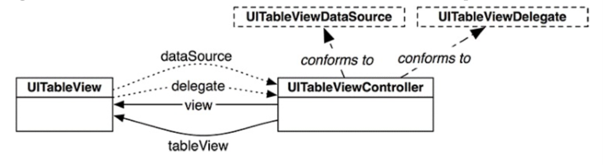

# TableView

## UITableViewController vs tableView

There are two ways to add a table view to your projects, depending on how you use the table view.

* One approach is to add a table view instance directly inside a view controller's view. Here, you may have other views your view controller manages, and the table view is only part of the view. In this case, you're responsible for the auto layout of the table view and therefore can position it any way you'd like. You're also responsible for setting the data source object and the delegate object. (You'll learn about the data source object and the delegate object later in this lesson.)
* The second approach is to add a table view controller to your storyboard. A table view controller is a view controller subclass that manages a single table view instance. Here, the table view takes up the entire view, and you can't adjust the table view's size. The table view controller also acts as the data source and delegate of the table view.

If you just want to display grocery items list with some header and footer, then `tableviewcontroller` should be priority. But if you want to display mail items in tableview, you would need some additional buttons for altering items in mail(tableview). For later case, you will use `viewcontroller`.

There are only two possible reasons you should choose to use `UIViewController` over `UITableViewController` when you need a view controller with a table view:

1. You need the table view to be smaller than the view controller's view.
2. You need to add additional views to the view controller that don't scroll with the table view (though there are ways to solve this with UITableViewController).

Here are all of the things that UITableViewController does for you that you would need to replicate:

* Defines and setups up the UITableView.
* Sets itself as the table view's dataSource and delegate.
* Overrides the setEditing:animated: method to also set the editing property of the table view.
* Deselects the last selected row in the viewWillAppear: method depending on the clearsSelectionOnViewWillAppear property.
* Flashes the table view's scrollbars in the viewDidAppear: method.
* Hooks up the refresh control (as of iOS 6).
* Reloads the table view the first time it will appear.
* Adjusts the table view's contentInset (as of iOS 7).
* Scrolls the table view as needed when the keyboard appears.

## Table View Protocols



A dynamic table view object must have a data source object—and may or may not have a delegate object. The data source mediates between the table view and your app's data model and the optional delegate manages the appearance (minus the actual cells) and the behavior of the table view.

`UITableViewController` is a `UIViewController` that implements a `UITableViewDataSource` and `UITableViewDelegate` protocol.

### Table View Data Source

When a table view wants to know what to display, it calls methods from `UITableViewDataSource` protocol. There are two required methods:

```Swift
tableView(_:numberOfRowsInSection:)
// This method tells the tableView how many rows it should display
```

```Swift
tableView(_:cellForRowAt:)
// This method tells the table view what content to display in each row

// We need to reuse a cell by dequeueing one:
let cell = tableView.dequeueReusableCell(withIdentifier: "ToDoItemCell", for: indexPath)

```

When the table view loads or reloads its data, it queries the data source by calling each of these methods (sometimes multiple times) to request information for the visible rows. Based on the parameters of these calls, it's the data source's job to return the requested info. As the user scrolls through the table view and different rows become visible, the table view also queries the data source for information to fill the rows about to be displayed.

## content Insets, avoid underlaping status bar

To have the table view cells not underlap the status bar, you will need to add some padding to the top o the table view. For this we use the `contentInset`property.

The `content inset` is the padding for all four sides of the view.

```Swift
    override func viewDidLoad() {
        super.viewDidLoad()

        //get the height of the status bar
        let statusBarHeight = UIApplication.shared.statusBarFrame.height

        let insets = UIEdgeInsets(top: statusBarHeight, left: 0, bottom: 0, right: 0)
        tableView.contentInset = insets
        tableView.scrollIndicatorInsets = insets
    }
```

## Reorder Cells

Table views provide a manageable way for users to control the order of cells. The UITableViewCell class defines a property `showsReorderControl` of type `Bool`. If this property is true, the table is in editing mode, and the data source method `tableView(_:moveRowAt:to:)` is implemented, the cell will display the reorder control to the right of its content.

```Swift
tableView(_:cellForRowAt:)

cell.showsReorderControl = true
```

```swift
override func tableView(_ tableView: UITableView, moveRowAt fromIndexPath: IndexPath, to: IndexPath) {
    let movedEmoji = emojisArray.remove(at: fromIndexPath.row)
    emojisArray.insert(movedEmoji, at: to.row)
    tableView.reloadData()
}
```