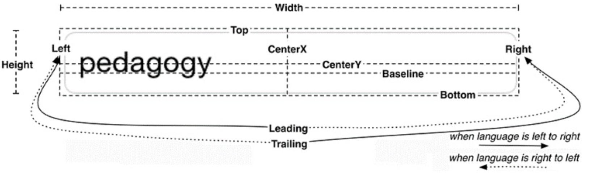

# Autolayout System

## Layout Attributes

## Constraints

In IOS you provide a set of constraints to align the views. A constraint defines a specific relationship in a view hierarchy that an be used to determine a layout attribute for one or more views.

## Nearest neighbor

The nearest neighbor is the closest sibling in a specified direction. If a view does not have any siblings in the specified direction, then the nearest neighbor is its superview, also known as its container.