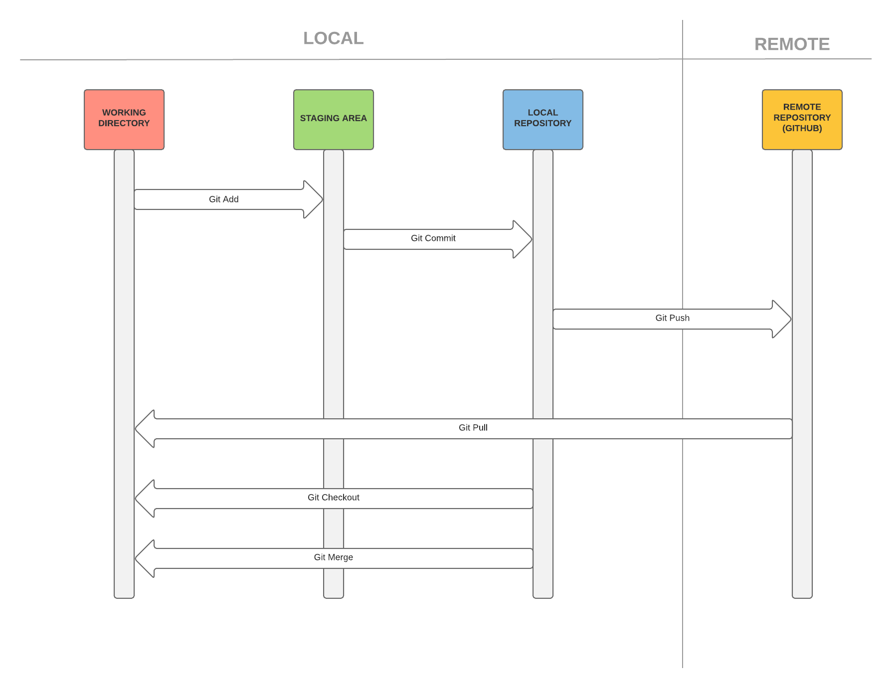

# Git

[GitHowto.com](https://githowto.com)

WorkFlow:

## start watching a directory for changes

Local:

`git init`

On-line:

`git clone www.URL.com`
`git clone /path/to/folder`

## Add changes

when one or several files are ready you send them to the staging area:

`git add xxx` 
`git add .` 
`git add *` 

The `add` command tells Git that you want to include updates to a particular file in the next commit.

Instead of committing all of the changes you've made since the last commit, the stage area lets you group related changes into highly focused snapshots before actually committing it to the project history.

## Commiting the propose changes

Once you have recopiled the files you want in the staging area, you commit those changes to the repository.

`git commit -m "message"`

Whenever you add, edit, or delete a file, you're making a commit, and adding them to your branch. This process of adding commits keeps track of your progress as you work on a feature branch.

Commits also create a transparent history of your work that others can follow to understand what you've done and why. Each commit has an associated commit message, which is a description explaining why a particular change was made.

commands:

 `Git log` is a journal that remembers all the changes we've committed so far, in the order we committed them.

## Creating a Branch

A `branch` basically is an independent mini repository that usually focuses on one feature. It’s independent from all of your teammate’s work. This means, if you mess something up in a branch, it won’t mess up all the other code in the project.

The new branch has all the code from the project, but you can work on it independently. When you commit changes, you commit to the new branch instead of the master branch. Once you are done, you can `merge` it back to the master branch.

If your team decided to forgot the feature, you can just remove the branch and no harm is done. Using branches is a much more organized way to add features to your app and it’s much safer also since it’s harder to mess up your whole project by accident.

To merge those new features to the master branch you use the command `merge`
