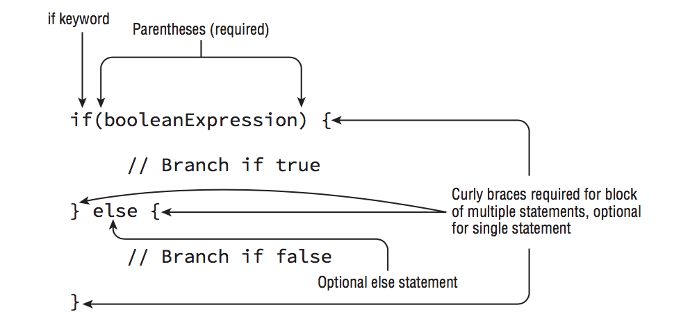

# If Statement

## If else



```Java
if(hourOfDay < 11) {
  System.out.println("Good Morning");
} else if(hourOfDay < 15) {
  System.out.println("Good Afternoon");
} else {
  System.out.println("Good Evening");
}
```

## Ternary Operator

The first operand must be a boolean expression, and the second and third can be any expression that returns a value.

```Java
booleanExpression ? expression1 : expression2
condition ? exprTrue : exprFalse
```

## Nesting ternary operators

Eg.:

```Java
(x > 2 ? x < 4 ? 10 : 8 : 7);
```

although parentheses are not required, they do greatly increase code readability, such as the following equivalent statement:

```Java
((x > 2) ? ((x < 4) ? 10 : 8) : 7)
```

We apply the outside ternary operator  first, as it is possible the inner ternary expression may never be evaluated. Since (x>2) is true, this reduces the problem to:

```Java
System.out.println((x < 4) ? 10 : 8)
```

Since x is greater than 2, the answer is 8, or option D in this case.