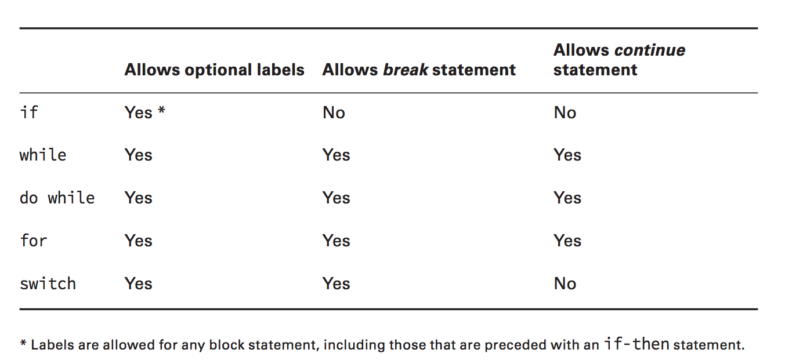

# Advanced flow control

## Optional labels

Statements can have optional labels. A label is an optional pointer to the head of a statement that allows the application flow to jump to it or break from it. It is a single word that is proceeded by a colon (:).

```Java
int[][] myComplexArray = {{5,2,1,3},{3,9,8,9},{5,7,12,7}};
OUTER_LOOP: for(int[] mySimpleArray : myComplexArray) {
  INNER_LOOP: for(int i=0; i<mySimpleArray.length; i++) {
    System.out.print(mySimpleArray[i]+"\t");
}
System.out.println(); }
```

## Break Statement

Ends the loop early transfering the flow of control out to the enclosing statement.

Notice that the break statement can take an optional label parameter.

## Continue Statement

Causes flow to finish the execution of the current loop and transfers control to the boolean expression that determines if the loop should continue. In other words, it ends the current iteration of the loop.


