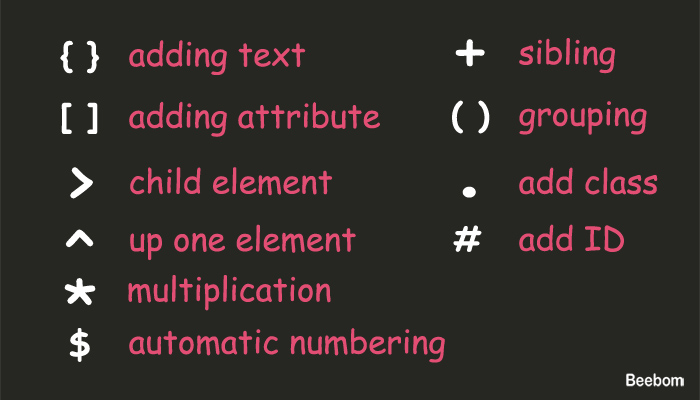

# Emmet in HTML

>https://www.sitepoint.com/faster-workflow-mastering-emmet-part-1/
>https://blog.teamtreehouse.com/using-emmet-speed-front-end-web-development
>https://beebom.com/best-emmet-tips-to-code-htmlcss-fast/

Emmet lets you write lightning fast code. The way of Emmet works is by typing your tab keyboard key when done writing syntax.

Example, `a` + `<tab>` is converted in `<a href=""></a>`.

The following are most common Emmet symbols that you can used.



## Nesting elements: `>`

To nest some elements you just need to add larger sign `>` after each tags you want to used.

```html
header>nav>ul>li

<!-- converts to -->

<header>
    <nav>
        <ul>
            <li></li>
        </ul>
    </nav>
</header>
```

## Sibling element: `+`

Sibling refers to the element in the same nesting level:

```html
header+article+footer

<!-- converts to -->

<header></header>
<article></article>
<footer></footer>
```

## Climb-up element: `^`

The climb-up `^` operator is used to move up one level in the tree structure. This can come in handy when you’re using the child operator `>`.

```html
section>div>p>a^p

<!-- converts to -->

<section>
    <div>
        <p><a href=""></a></p>
        <p></p>
    </div>
</section>
```

## Assigning ID or Class

Emmet is also able to include your prefered class or ID name within the tag. The sign you’ll use is the same like class or ID selector in CSS: dot `.` sign and `#` sign.

```html
#thisID
.thisId

<!-- converts to -->

<div id="thisID"></div>
<div class="thisClass"></div>
```

When we do not specify the element, as you can see above, Emmet will use `<div>` as the default. If we want to be more specific, we can declare the element type before the class or the ID name, like so.

```html
nav#navbar
article.post

<!-- converts to -->

<nav id="navbar"></nav>
<article class="post"></article>
```

Specifically for the HTML class, we can assign multiple classes in one element in this way:

```html
div.class1.class2.class2

<!-- converts to -->

<div class="class1 class2 class3">
```

## Assigning Attribute

```html
img[src="image.png"]
span[data-hint]

<!-- converts to -->


<span data-hint=""></span>
```

## Setting Text

You can set the text that should be contained within an element by placing it in curly braces `{}`.

```html
p{Hello Treehouse!}

<!-- converts to -->

```html
<p>Hello Treehouse!</p>
```

## Multiplication

Emmet also allows us to add HTML element in specific numbers using the asterisk (*) sign.

```html
section>h3+h4*3

<!-- Converts to -->

<section>
<h3></h3>
<h4></h4>
<h4></h4>
<h4></h4>
</section>
```