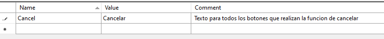

# Manual de localización: localizar texto

Para traducir una cadena de texto en *Xamarin.Forms* seguiremos dos pasos:

## 1. Añadir la traducción a los archivos *.RESX*

Estos archivos son *XML* especiales con 3 campos:

- **Name**: Nombre de la variable que representa el valor de la traducción.
- **Value**: Valor de la traducción
- **Comment** (opcional): Comentario para servirnos de indicación.

Si quisiéramos añadir la traducción *"Cancel / Cancelar"* haríamos:



## 2. Usar la referencia de la traducción

Suponiendo que nuestros archivos .RESX estuvieran en la ruta **Resources/Localization**, usaremos la traducción de la siguiente manera:

En XAML:

```xml
    <!-- importamos la clase con las traducciones -->
<ContentPage
    xmlns:Res="clr-namespace:GESMOBILE_Inventory.Resources.Localization" >

    <!-- Usamos la traducción -->
    <Label Text="{x:Static Res:Lang.Cancelar}"

```

En C#:

```cs
// importamos traducción
using GESMOBILE_Inventory.Resources.Localization;

Label notesLabel = new Label
{
    // usamos la traducción
    Text = Lang.Cancelar, 
    // ...
};
```

## Localización de Imágenes

Dado que cada plataforma almacena las imágenes con una estructura de archivos única, el código XAML usa la clase *OnPlatform* para establecer la propiedad *ImageSource* según la plataforma actual:

```xml
<Image>
    <Image.Source>
        <OnPlatform x:TypeArguments="ImageSource">
            <On Platform="iOS, Android" Value="flag.png" />
            <On Platform="UWP" Value="Assets/Images/flag.png" />
        </OnPlatform>
    </Image.Source>
</Image>
```

## Pruebas

La mejor manera de probar la localización consiste en cambiar el idioma del dispositivo.

En iOS, en la aplicación de configuración, puede establecer el idioma de cada aplicación específicamente sin cambiar el idioma del dispositivo.

En Android, la configuración de idioma se detecta y se almacena en caché cuando se inicia la aplicación. Si cambia de idioma, es posible que haya que salir de la aplicación y reiniciarla para ver los cambios aplicados.