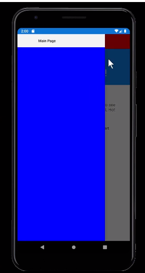
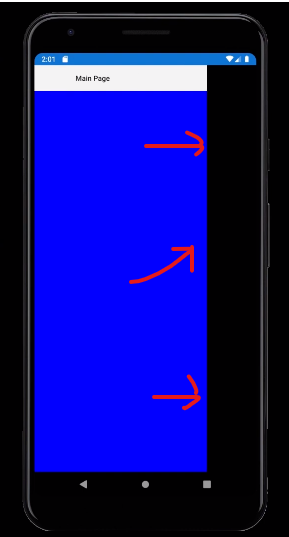

# Xamarin Colors 

Shell provides colors for styling most anything you can see in the chrome of your application such.

## Colors

- **Shell.BackgroundColor** - the background of the shell, which comes through in the navigation bar (title bar) area
- **Shell.TitleColor** - the color of the title in the navigation bar
- **Shell.ForegroundColor** - the tint color for things like the menu icon
- **Shell.TabBarBackgroundColor** - color behind the tabs on the bottom
- **Shell.TabBarTitleColor** - the color of the labels and icons of the selected tab
- **Shell.TabBarUnselectedColor** - the color of the labels and icons that are unselected

https://dev.to/dotnet/exploring-colors-in-xamarin-forms-shell-16g3


## Navigation bar Color

```xml
<!-- AppShell.xaml -->
<Shell 
    ...
    Backgroundcolor="Red"
    ...
>
```


## Flyout Background Color

```xml
<!-- AppShell.xaml -->
<Shell 
    ...
    FlyoutBackgroundcolor="Blue"
    ...
>
```



## Flyout transparencia pagina que queda debajo

```xml
<!-- AppShell.xaml -->
<Shell 
    ...
    FlyoutBackdrop="black"
    ...
>
```

