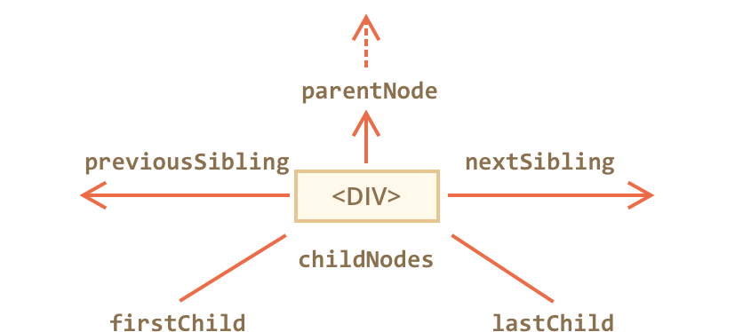

# The document object

The Document Object Model is an interface that allows a programming language to manipulate the content, structure, and style of a website. JavaScript is the client-side scripting language that connects to the DOM in an internet browser.

## The DOM Tree and Nodes

All items in the DOM are defined as **nodes**. There are many types of nodes, but there are three main ones that we work with most often:

| Node Type   | Value | Example                             |
| ----------- | ----- | ----------------------------------- |
| **Element** | 1     | `<body>`                            |
| **Text**    | 3     | Text that is not part of an element |
| **Comment** | 8     | `<!-- an HTML comment -->`          |

When an HTML element is an item in the DOM, it is referred to as an element node. Any lone text outside of an element is a text node, and an HTML comment is a comment node. In addition to these three node types, the document itself is a document node, which is the root of all other nodes.

The DOM consists of a tree structure of nested nodes, which is often referred to as the DOM tree.

Every node in a document has a node type, which is accessed through the `nodeType` property. Below is a chart of the most common node types that we are working with in this tutorial.

## Walking the DOM

DOM navigation properties are great when elements are close to each other.



Given a DOM node, we can go to its immediate neighbours using navigation properties. There are two main sets of them:

- For all nodes: `parentNode`, `childNodes`, `firstChild`, `lastChild`, `previousSibling`, `nextSibling`.
- For element nodes only: `parentElement`, `children`, `firstElementChild`, `lastElementChild`, `previousElementSibling`, `nextElementSibling`.

## Example

```javascript
elem.childNodes[0] === elem.firstChild
elem.childNodes[elem.childNodes.length - 1] === elem.lastChild
```

There’s also a special function `elem.hasChildNodes()` to check whether there are any child nodes.

## Example

For the page:

```html
<html>
<body>
  <div>Users:</div>
  <ul>
    <li>John</li>
    <li>Pete</li>
  </ul>
</body>
</html>
```

❔ How to access:

The `<div>` DOM node?<br>
The `<ul>` DOM node?<br>
The second `<li>` (with Pete)?<br>

💡 Solution:

There are many ways, for instance:

The `<div>` DOM node:

```javascript
document.body.firstElementChild
// or
document.body.children[0]
// or (the first node is space, so we take 2nd)
document.body.childNodes[1]
```

The `<ul>` DOM node:

```javascript
document.body.lastElementChild
// or
document.body.children[1]
```

The second `<li>` (with Pete):

```javascript
// get <ul>, and then get its last element child
document.body.lastElementChild.lastElementChild
```
